<style>
    @import url("https://fonts.googleapis.com/css2?family=Dosis:wght@200..800&family=Fira+Sans:ital,wght@0,100;0,200;0,300;0,400;0,500;0,600;0,700;0,800;0,900;1,100;1,200;1,300;1,400;1,500;1,600;1,700;1,800;1,900&family=Kablammo&family=Teko:wght@300..700&display=swap");

    body {
        background-color: #0f1014;
        color: #e3e4e8;
        font-family: "Fira Sans";
    }

    h1, h2, h3, h4, h5, h6 {
        font-family: Dosis;
        text-transform: uppercase;
        font-weight: bold !important;
        margin-top: 30px !important;
    }

    img {
        display: block;
        margin-left: auto;
        margin-right: auto;
        margin-top: 30px;
        margin-bottom: 30px;
        border-radius: 20px;
        background-color: transparent;
        border: 2px solid #59607d !important;
    }

    a {
      color: #06b6d4 !important;
    }

    a:hover {
      color: #14b8a6 !important;
      text-decoration: none !important;
    }

    pre {
      background-color: #282c39 !important;
    }

    p > code {
      background-color: #282c39 !important;
    }

    .markdown-body img {
      background-color: transparent;
    }

    .highlight {
      background-color: transparent;
    }
</style>


## Johdanto <!-- omit in toc -->

Tervetuloa lukemaan Curian käyttöohjetta! Curia on juttuluetteloiden laatimiseen hallinnonalan sisäisesti kehitetty avoimen lähdekoodin sovellus. Sovelluksella pyritään helpottamaan juttuluetteloiden laatimista AIPAn tuottamien CSV-tiedostojen ja Sakari-tietojen perusteella sekä mahdollistamaan luetteloiden järjestelmällisempi hallitseminen. Lisäksi sovellus yhdenmukaistaa juttuluetteloita ulkonäöltään ja asetteluiltaan.

Curian lähdekoodi löytyy [täältä](https://github.com/TheGreenBureau/curia).

Sovelluksen käyttäminen on varsin helppoa! Seuraavissa osioissa selostetaan toimintojen pääpiirteet.

## Sisällys <!-- omit in toc -->

- [1. Asentaminen](#1-asentaminen)
- [2. Päänäkymä](#2-päänäkymä)
  - [2.1. Asetukset](#21-asetukset)
    - [2.1.1. Juttuluetteloiden sijainti](#211-juttuluetteloiden-sijainti)
    - [2.1.2. Oletustiedot](#212-oletustiedot)
- [3. Juttuluetteloiden selaaminen](#3-juttuluetteloiden-selaaminen)
  - [3.1. Juttulistojen suodattaminen](#31-juttulistojen-suodattaminen)
  - [3.2. Valitseminen päivämäärällä](#32-valitseminen-päivämäärällä)
  - [3.3. Lista löydetyistä juttuluetteloista](#33-lista-löydetyistä-juttuluetteloista)
  - [3.4. Tuominen tiedostosta](#34-tuominen-tiedostosta)
- [4. Uuden juttuluettelon luominen](#4-uuden-juttuluettelon-luominen)
- [5. Juttuluettelonäkymä ilman juttuja](#5-juttuluettelonäkymä-ilman-juttuja)
  - [5.1. Tuomioistuimen tietojen muokkaaminen](#51-tuomioistuimen-tietojen-muokkaaminen)
  - [5.2. Uusi juttu](#52-uusi-juttu)
  - [5.3. Tuo CSV](#53-tuo-csv)
- [6. Juttuluettelonäkymä jutuilla](#6-juttuluettelonäkymä-jutuilla)
  - [6.1. Näkymässä suoraan toteutettavat toiminnot](#61-näkymässä-suoraan-toteutettavat-toiminnot)
    - [6.1.1. Juttujen uudelleen järjestäminen](#611-juttujen-uudelleen-järjestäminen)
    - [6.1.2. Asian merkitseminen salaiseksi](#612-asian-merkitseminen-salaiseksi)
    - [6.1.3. Huomioiden lisääminen ja näkyvyys](#613-huomioiden-lisääminen-ja-näkyvyys)
  - [6.2. Näkymältä erikseen aukevat toiminnot](#62-näkymältä-erikseen-aukevat-toiminnot)
    - [6.2.1. Henkilöiden lisääminen ja tietojen muokkaaminen](#621-henkilöiden-lisääminen-ja-tietojen-muokkaaminen)
    - [6.2.2. Jutun poistaminen](#622-jutun-poistaminen)
    - [6.2.3. Juttujen asettaminen aikajärjestykseen](#623-juttujen-asettaminen-aikajärjestykseen)
    - [6.2.4. Uuden asian luominen ja CSV-tiedoston tuominen](#624-uuden-asian-luominen-ja-csv-tiedoston-tuominen)
    - [6.2.5. Esikatselu](#625-esikatselu)
    - [6.2.6. Juttuluetteloiden tallentaminen PDF-muodossa](#626-juttuluetteloiden-tallentaminen-pdf-muodossa)
- [7. Muutosten tallentuminen](#7-muutosten-tallentuminen)
- [8. Kielivalinnoista ja käännöksistä](#8-kielivalinnoista-ja-käännöksistä)

## 1. Asentaminen

Curia löytyy asennettavana sovelluksena Software Centeristä. Helpoiten löydät sen kirjoittamalla Software Centerin hakukenttään "curia" ja painamalla Enter. Varsinainen asennus tapahtuu, kuten muillakin Software Centeristä asennettavilla sovelluksilla.

Asennuksen jälkeen Curia käynnistyy. Sille luodaan pikakuvakkeet työpöydälle ja käynnistysvalikkoon.

## 2. Päänäkymä

Curia avautuu ensimmäisenä seuraavaan päänäkymään:

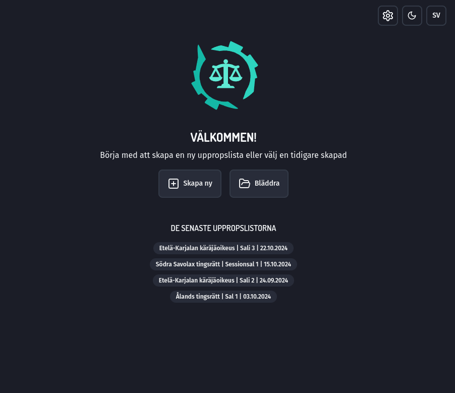

Päänäkymässä on mahdollista tehdä seuraavat toimenpiteet:

1. Siirtyä uuden juttuluettelon luomiseen
2. Selata ja poistaa aikaisempia juttuluetteloja
3. Avata jokin viimeisimmästä viidestä käsitellystä juttuluettelosta
4. Muuttaa asetuksia (hammasrataspainike)

Lisäksi on mahdollista tehdä seuraavat, muissakin näkymissä näkyvät toimenpiteet:

1. Muuttaa sovelluksen teemaa (tumma, vaalea tai järjestelmä)
2. Muuttaa sovelluksen kieltä (suomi tai ruotsi)

### 2.1. Asetukset

Sovelluksen asetukset näyttävät seuraavilta:

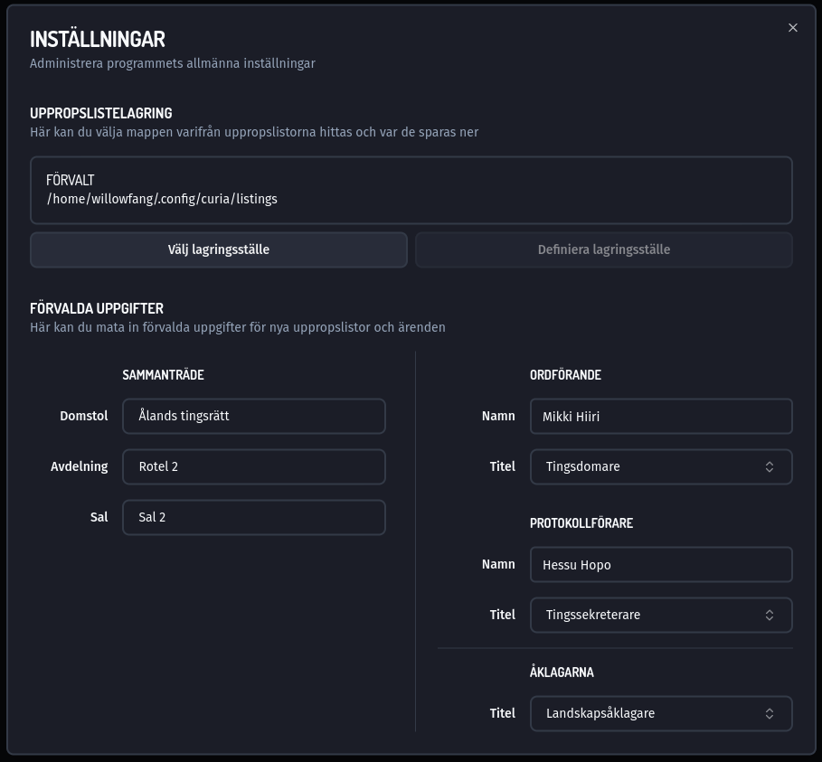

#### 2.1.1. Juttuluetteloiden sijainti

Tässä voit valita sen, mihin tekemäsi juttuluettelot tallennetaan ja mistä tallennettuja juttuluetteloita etsitään. Kuvassa kyseessä on oletuskansion sijainti Linux-käyttöjärjestelmässä. Windowsissa oletussijainti on suurin piirtein jotain seuraavaa:

```
C:\Käyttäjät\[KIEKU-TUNNUS]\AppData\curia\listings
```

Sijaintia voi vaihtaa esimerkiksi yhteisesti sovittuun verkkolevykansioon, johon juttuluettelotiedostot tallennetaan. Tällöin kaikki saman toimipaikan käyttäjät pääsevät käsiksi samoihin luetteloihin.

Juttuluettelot ovat, ennen viemistä PDF-muotoon, tallennettuna JSON-muodossa. Kyseinen muoto on ennen kaikkea tarkoitettu koneen luettavaksi. Lisäksi juttuluettelot tallennetaan yksilöllisillä, automaattisesti luoduilla nimillä (esim. `11ffd37c-c743-43f1-83ae-4b2da56e17ab.jtl`). Juttuluettelokansiota ei olekaan tarkoitettu selattavaksi esimerkiksi resurssinhallinnassa, vaan tarkasteltavaksi suoraan sovelluksessa.

#### 2.1.2. Oletustiedot

Tässä voit valita tiedot, jotka uusille juttuluetteloille annetaan oletusarvoisesti.

AIPAn tuottamassa CSV-tiedostossa ei ole tuomioistuinta tai kokoonpanoa koskevia tietoja, vaan ne on syötettävä käyttäjän toimesta erikseen. Tähän on kuitenkin mahdollista määrittää oletukset, jotta joka kerta juttuluetteloa luotaessa ei tarvitse kirjoittaa samoja tietoja. Oletustietoja voi muuttaa juttuluettelokohtaisesti.

Tuomioistuimia koskevat valinnat perustuvat kyselyyn, joka tuomioistuimille tehtiin vuoden 2024 aikana ja jossa tiedusteltiin muun muassa kunkin tuomioistuimen ruotsin kielistä nimeä, osastoja, saleja ja istuntopaikkoja.

Virkanimikkeet sisältävät valmiita valintoja, joita voi käyttää. Nämä valinnat käännetään automaattisesti ruotsiksi tai suomeksi sen mukaan, minkä kielinen juttuluettelo ollaan viemässä PDF-muotoon. Virkanimikkeeseen on mahdollista syöttää myös vapaata tekstiä. Tällöin käännöstä ei kuitenkaan voida automaattisesti tehdä.

## 3. Juttuluetteloiden selaaminen

Juttuluetteloiden selausnäkymä näyttää seuraavalta:

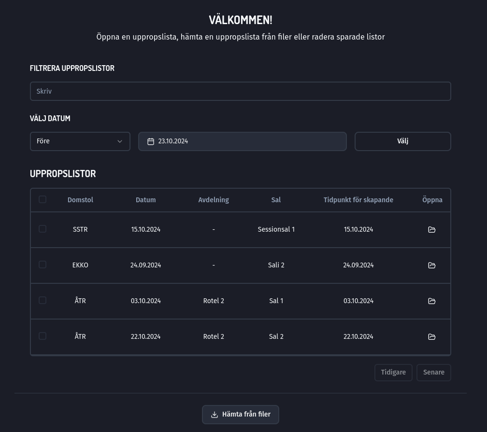

Selausnäkymästä löydät seuraavat toiminnot:

### 3.1. Juttulistojen suodattaminen

Kyseessä on vapaa merkkihaku, joka hakee annettua merkkijonoa kaikista taulukon kentistä. Esimerkiksi "15.10." löytää kaikki juttuluettelot, joiden päivämäärä tai luomisaika on 15.10.

### 3.2. Valitseminen päivämäärällä

Tämän toiminnon avulla voi valita kaikki kansiosta löytyvät juttuluettelot, joiden _päivämäärä_ (ei siis luomisaika) on ennen tai jälkeen valitun päivämäärän. Toiminnolla on siis mahdollista esimerkiksi poistaa kerralla kaikki tietyn iän ylittäneet juttuluettelot.

Tätä kannattaa käyttää varovasti, ettei tule poistaneeksi vahingossa sellaisia luetteloita, joita ei ole ollut tarkoitus poistaa. Poisto on pysyvä - poistettuja luetteloita ei voi palauttaa!

Poisto kuitenkin pyydetään vahvistamaan, ennen kuin se toteutetaan. Poistaminen täytyy lisäksi valita erikseen. Pelkää päiväämäärällä valitseminen ei vielä tee muuta, kuin kyseisen valinnan. Otsikko "Valitse päivämäärällä" muuttaa väriään, kun asioita on valittuna nimenomaan kyseisen toiminnon perusteella.

### 3.3. Lista löydetyistä juttuluetteloista

Tässä listataan kaikki asetuksissa valitusta juttuluettelokansiosta löydetyt juttuluettelot tietoineen. Näkymässä näytetään kerrallaan 10 juttuluetteloa. Seuraavalle ja edelliselle sivulle pääsee siirtymään "Edellinen" ja "Seuraava" -painikkeilla. Käytännössä juttulistan löytää helpoiten hakemalla sitä.

Listanäkymän otsikot ovat klikattavia. Otsikkoa klikkaamalla lista järjestetään kyseisen tiedon perusteella joko nousevaan tai laskevaan järjestykseen.

Yksittäisen juttulistan saa avattua klikkaamalla rivin viimeisenä olevaan kansion kuvaa.

Yksittäisiä juttuluetteloita saa valittua vasemman laidan tikkibokseista. Otsikkorivin laatikosta saa valittua kaikki juttuluettelot. Kun yksi tai useampi juttuluettelo on valittu, näytetään "Poista" -painike. Sitä klikkaamalla voi poistaa valitut juttuluettelot.

Kuten ylempänä on mainittu, juttuluetteloiden poistaminen on pysyvä toimenpide! Ole siis tarkkana siinä, mitä juttuluetteloita poistat. Poistaminen pyydetään varmistamaan, ennen kuin se toteutetaan.

### 3.4. Tuominen tiedostosta

Mikäli sinulla on juttuluettelotiedosto (.jtl) jossakin muualla, kuin asetuksissa valitussa juttukansiossa, voit tuoda sen Curiaan klikkaamalla "Tuo tiedostosta" -painiketta. Juttuluettelotiedostoja voi lähettää esimerkiksi sähköpostilla, jos siihen on tarvetta.

## 4. Uuden juttuluettelon luominen

Uuden juttuluettelon luomisnäkymä näyttää seuraavalta:

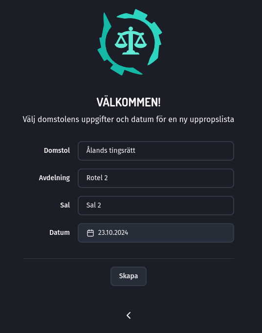

Valintoihin syötetään tuomioistuimen tiedot. Valinnoiksi tuodaan asetuksissa annetut oletustiedot, mutta niitä on mahdollista tässä muuttaa (ja vielä myöhemminkin).

Lisäksi annetaan juttuluettelon päivämäärä. Oletusarvoksi annetaan nykyhetki.

## 5. Juttuluettelonäkymä ilman juttuja

Uusi juttuluettelo avautuu seuraavaan näkymään:

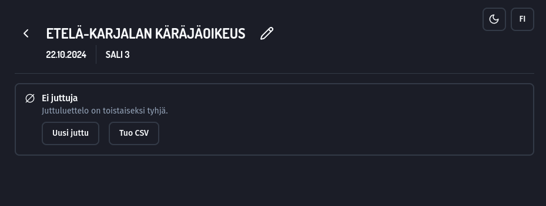

### 5.1. Tuomioistuimen tietojen muokkaaminen

Tuomioistuinta koskevia tietoja on mahdollista muokata klikkaamalla kynänkuvaa tuomioistuimen nimen vieressä. Kyseinen valikko avautuu näin:

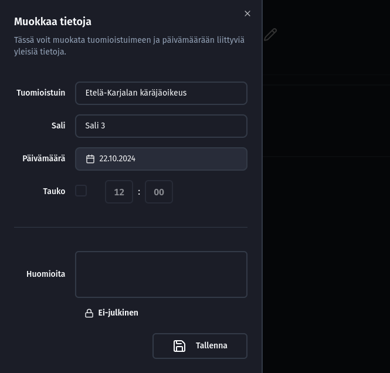

Valikossa voit muuttaa tietoja, kuten aikaisemmin juttuluetteloa luodessasi. Lisäksi voit lisätä tiedon tauon ajankohdasta.

Koko juttulistaa koskevat huomiot (joita tässä siis voi lisätä) voidaan näyttää kolmella eri tavalla.

1. Ei-julkiset huomiot näkyvät vain Curian sisällä. Niitä voi siis käyttää omina muistiinpanoina, joita _ei näytetä_ juttulistan PDF-versioissa (julkisessa tai syyttäjäkappaleessa).

2. Julkiset huomiot näkyvät sekä julkisessa juttulistassa että sen syyttäjäkappaleessa. Kyseessä voi olla mikä tahansa yleinen merkintä, joka syystä tai toisesta halutaan juttulistaan (esim. "Huom! Sali vaihtunut.").

3. Syyttäjää koskevat huomiot näytetään ainoastaan juttulistan syyttäjäkappaleessa, mutta _ei_ julkisessa versiossa.

Muutokset pysyvät, kun klikkaat "Tallenna" -painiketta. Jos klikkaat avautuneen ikkunan ulkopuolelle tai oikean yläkulman sulkupainiketta, ikkuna suljetaan ja muutoksia ei tallenneta.

### 5.2. Uusi juttu

Klikkaamalla tätä painiketta voit luoda manuaalisesti uuden asian (esim. Sakarin tietojen perusteella). Uuden jutun tietojen ikkuna aukeaa seuraavan näköisenä:

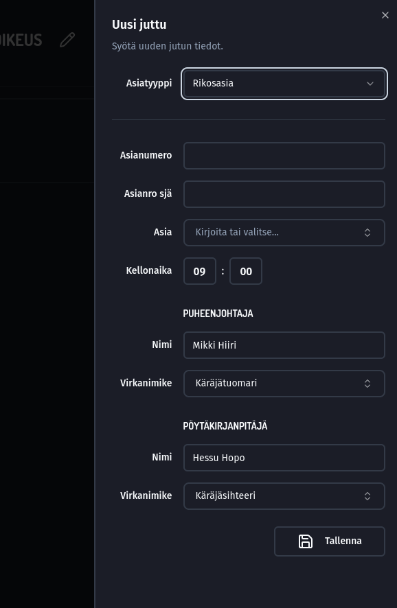

Aukeavaan ikkunaan voit syöttää asian tiedot.

Asialuettelossa listataan kaikki rikosnimikkeet Tilastokeskuksen rikosnimikekoodiston mukaisesti ja kielivalinnan mukaan suomeksi tai ruotsiksi. Nimikkeitä voi hakea ja ne käännetään automaattisesti sen mukaan, onko kielivalinta kulloinkin suomi vai ruotsi. Kenttään on myös mahdollista syöttää vapaata tekstiä, mutta sitä ei voida automaattisesti kääntää.

Puheenjohtajan ja pöytäkirjanpitäjän tiedot (kyseiselle asialle) tuodaan asetuksissa annetuista oletustiedoista, mutta niitä voi vaihtaa tässä (ja vielä myöhemminkin).

Kun tiedot ovat valmiit, klikkaa "Tallenna" -painiketta, niin juttu lisätään juttulistaan. Jos klikkaat ikkunan ulkopuolelle tai yläkulman sulkupainiketta, ikkuna suljetaan tietoja tallentamatta ja lisäämättä juttua listaan.

### 5.3. Tuo CSV

Klikkaamalla tätä painiketta saat etsittyä koneeltasi .csv -muotoisen juttulistan, jonka olet tallentanut AIPAsta. Kyseisen CSV-tiedoston tiedot tuodaan juttulistaan ominta juttuinaan ja seuraavilla asetuksissa syötetyillä oletustiedoilla (joita CSV-tiedostosta ei löydy):

1. Puheenjohtaja
2. Pöytäkirjanpitäjä
3. Syyttäjän (tai syyttäjien) virkanimike

Jutuille tuodaan CSV-tiedostosta seuraavat tiedot:

1. Kellonaika
2. Asianimike
3. Asianumerot
4. Syyttäjä(t)
5. Vastaajat

AIPAn rikosnimikkeet vastaavat Tilastokeskuksen rikosnimikekoodistoa, joten ne ovat suoraan käännettävissä ruotsiksi tai suomeksi juttuluettelossa.

Tuodut jutut järjestetään juttuluetteloon siinä järjestyksessä, kuin ne on sisällytetty CSV-tiedostoon.

Juttulistalle voi tuoda niin monta CSV-tiedostoa, kuin haluaa. Mikäli tuotavan CSV-tiedoston asioissa on sellaisia asioita, joiden tuomioistuimen asianumero löytyy jo juttulistalta, lisäämisen sijaan olemassaoleva juttu päivitetään.

Tämä mahdollistaa sen, että jo kerran tuodun CSV-tiedoston tiedot päivitetään juttuluettelolle AIPAssa muokattujen tietojen perusteella. Se tapahtuu tallentamalla AIPAsta uusi CSV-tiedosto ja tuomalla se Curiaan. Mikäli näin toimitaan, AIPAssa päivältä poistuneet jutut poistetaan myös Curian juttuluettelosta, uudet jutut lisätään ja olemassaolevat päivitetään (esim. kellonaika ja vastaajat). Manuaalisesti luotuihin asioihin tällä ei ole vaikutusta. Listaan kirjatut Sakari-asiat säilyvät siis muuttumattomina, vaikka listalle tuotaisiinkin uusi CSV-tiedosto.

## 6. Juttuluettelonäkymä jutuilla

Kun juttuluetteloon on luotu tai tuotu asioita, se näyttää seuraavalta:

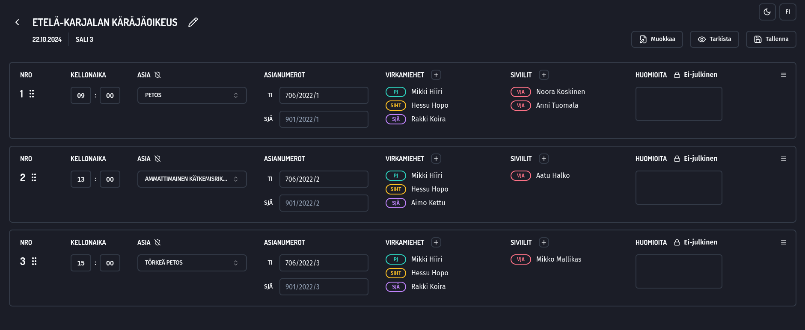

Tässä näkymässä on mahdollista suoraan:

1. Järjestää juttuja uudelleen
2. Muokata kellonaikaa, asianimikettä sekä asianumeroita
3. Lisätä huomioita jutulle
4. Merkitä asia salaiseksi

### 6.1. Näkymässä suoraan toteutettavat toiminnot

#### 6.1.1. Juttujen uudelleen järjestäminen

Juttujen uudelleen järjestäminen onnistuu nappaamalla kiinni jutun järjestysnumeron vieressä olevista kuudesta pisteestä ja raahaamalla juttua ylös tai alas listalla. Numero päivittyy järjestyksen mukaan.

#### 6.1.2. Asian merkitseminen salaiseksi

Asian saa merkittyä salaiseksi klikkaamalla "Asia" -otsikon vieressä olevaa kilpikuvaketta. Salaisissa asioissa on näkymässä teksti "Salainen" sekä punainen reunus. Tällaisiin asioihin laitetaan juttuluetteloon näkyviin merkintä "Salainen".

#### 6.1.3. Huomioiden lisääminen ja näkyvyys

Huomioiden näkyvyyteen pätee sama, mitä on todettu kohdassa "7.1. Tuomioistuimen tietojen muokkaaminen". Nämä kyseiset huomiot näytetään, sikäli kuin näkyvyydeksi on valittu "Julkinen" tai "Syyttäjä", juttuluettelolla kyseisen jutun yhteydessä. Näiden avulla on siis mahdollista merkitä joitain huomioita koskien nimenomaan kyseistä juttua, eikä istuntopäivää yleisesti.

### 6.2. Näkymältä erikseen aukevat toiminnot

Näkymältä erikseen aukeavissa ikkunoissa voi:

1. Lisätä virkamiehiä tai siviileitä
2. Muokata olemassaolevien virkamiesten ja siviilien tietoja
3. Poistaa jutun
4. Järjestää jutut aikajärjestykseen
5. Luoda uuden asian
6. Tuoda CSV-tiedoston
7. Esikatsella julkista versiota tai syyttäjäkappaletta
8. Tallentaa julkisen version tai syyttäjäkappaleen

#### 6.2.1. Henkilöiden lisääminen ja tietojen muokkaaminen

Henkilöt asialla on jaettu virkamiehiin (oikeushallinnon alalla työskentelevät) ja siviileihin (kaikki muut). "Siviilit" on valittu otsikoksi, koska ryhmä sisältää muun muassa todistajat. Henkilöiden nimen vieressä näytetään lyhenteenä ja värikoodattuna kyseisen henkilön asema asiassa.

Julkisessa juttulistassa näytetään ainoastaan tuomioistuimen kokoonpano, syyttäjät sekä vastaajat. Syyttäjän kappaleessa näytetään myös muut jutulle mahdollisesti lisätyt henkilöt, kuten asianomistajat, sekä näille mahdollisesti lisätyt haastamis- ja muut tiedot.

Uuden henkilön saa lisättyä asialle klikkaamalla otsikon vieressä olevaa +-painiketta. Vastaavasti olemassaolevan henkilön tietoja saa muokattua klikkaamalla henkilön nimeä. Kummassakin tapauksessa aukeva ikkuna on saman näköinen.

Virkamiehen muokkaamisen ikkuna näyttää seuraavalta:


Virkamiehen aseman perusteella valitaan mahdolliset virkanimikkeet. Kuten todettu, virkanimikkeeseen voi syöttää vapaatakin tekstiä, mutta sitä ei käännetä automaattisesti toiselle kielelle.

Vastaavasti siviilin muokkaamisen ikkuna näyttää tältä:

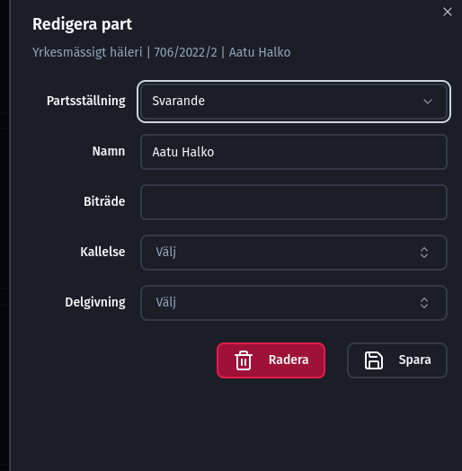

Kuten virkamiehenkin kohdalla, näytettävät kentät ja niihin annettavat valinnat riippuvat siviilille annetusta asemasta.

Uuden henkilön tai henkilölle tehdyt muokkaukset voi tallentaa klikkaamalla "Tallenna" -painiketta. Jos klikkaat ikkunan ulkopuolelle tai yläreunan sulkupainiketta, muutoksia tai uutta henkilöä ei tallenneta. Henkilön voi poistaa kokonaan jutulta klikkaamalla "Poista" -painiketta.

#### 6.2.2. Jutun poistaminen

Juttu on mahdollista poistaa klikkaamalla yksittäisen juttumerkinnän oikeassa laidassa olevaa hampurilaisvalikkoa ja valitsemalla sitten "Poista".

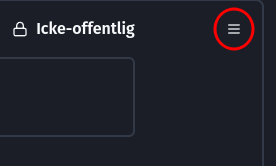

#### 6.2.3. Juttujen asettaminen aikajärjestykseen

Jutun on mahdollista järjestää automaattisesti alkamiskellonajan mukaiseen aikajärjestykseen juttuluettelolla. Valinta löytyy klikkaamalla "Muokkaa" ja sitten "Aikajärjestys", seuraavasti:

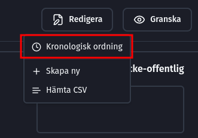

Mikäli jutut ovat jo listalla aikajärjestyksessä, mainittu painike on harmaana eikä sitä voi painaa.

Jos useammalle jutulle on asetettu sama alkamiskellonaika, nämä jutut järjestetään asialle siinä järjestyksessä, jossa ne jo valmiiksi ovat keskinäisessä suhteessaan. Käytännössä siis lähes sattumanvaraisesti. Näiden järjestystä voi sitten muuttaa käsin raahamalla, mikäli se on tarpeen.

#### 6.2.4. Uuden asian luominen ja CSV-tiedoston tuominen

Näistä pätee se, mitä on todettu kohdissa "7.2. Uusi juttu" ja "7.3. Tuo CSV". Painikkeet löytyvät "Muokkaa" -painikkeen takaa:

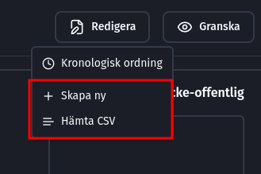

#### 6.2.5. Esikatselu

Sekä julkisen kappaleen että syyttäjäkappaleen PDF-tulosteen esikatselu on mahdollista "Tarkista" -painikkeesta:

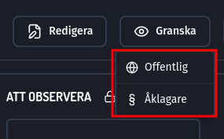

Esikatseltava asiakirja avataan erilliseen ponnahdusikkunaa. Kyseinen esikatselu vastaa yksi yhteen sitä asiakirjaa, joka valittaessa myös tallennettaisiin. Mikäli juttuluetteloon tehdään muutoksia, esikatselu päivittyy.

#### 6.2.6. Juttuluetteloiden tallentaminen PDF-muodossa

Lopulliset juttuluettelot tallennetaan PDF:nä klikkaamalla "Tallenna" -painiketta ja valitsemalla sitten, halutaanko tallentaa julkinen kappale vai syyttäjän kappale:

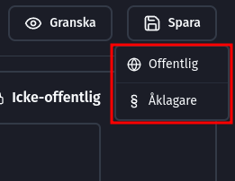

Tallennussijaintia kysytään valinnan jälkeen erikseen. Tallennettavalle tiedostolle annetaan oletusnimi, joka sisältää:

1. Tiedon päivämäärästä (muodossa vuosi-kuukausi-päivä, jotta tiedosto järjestyy resurssinhallinnassa oikein)
2. Tuomioistuimen lyhenne
3. Salitieto
4. Tieto siitä, onko kyseessä julkinen kappale vai syyttäjän versio

Tallennettavan tiedoston nimeä voi halutessaan muuttaa.

## 7. Muutosten tallentuminen

Juttuluetteloon tehtävät muutokset tallennetaan pääasiassa automaattisesti. Jos siten muutat esimerkiksi jutun asianumeroita, ei muutosta tarvitse mitenkään erikseen tallentaa.

Sikäli, kuin jotkin muutokset tulee erikseen hyväksyä, niitä koskien sovelluksessa on näkyvästi esillä "Tallenna" -painike tai niistä muuten ilmoitetaan näkyvästi.

## 8. Kielivalinnoista ja käännöksistä

Kaikki käännökset sekä sovellukseen että juttuluetteloon toteutaan, kun valitaan toinen kieli. Siten juttuluettelot on mahdollista suoraan kääntää esimerkiksi suomesta ruotsiksi valitsemalla sovelluksen kieleksi ruotsin.

Tällöin käännetään muun muassa juttuluettelon otsikot, tuomioistuimen tiedot (sikäli kuin ne on ruotsiksi ilmoitettu) sekä muut kuin vapaana tekstinä syötetyt asianimikkeet ja virkanimikkeet. Lisäksi käännetään muut, valmiina sisältönä juttuluetteloon sisällytettävät tekstit.

Curia ei siis tuota niin sanottuja kaksikielisiä juttuluetteloja, mutta yhdellä painikkeella koko juttuluettelon saa käännettyä toiselle kielelle. Juttuluettelosta voi tallentaa sitten kaksi versiota, joista toinen on suomen ja toinen ruotsin kielinen. Nämä voidaan myös tulostaa asetettavaksi näytille vierekkäin.
