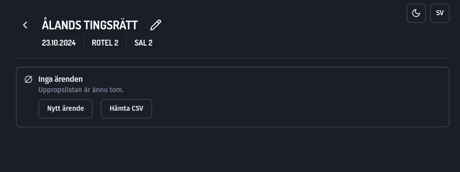
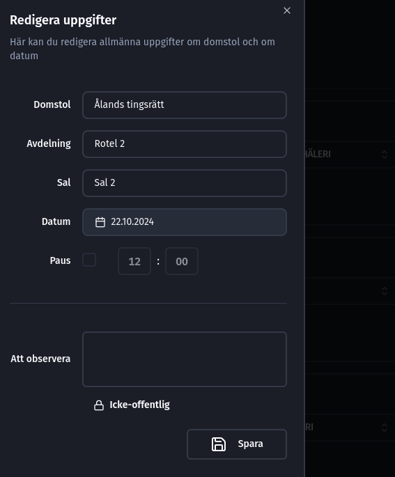
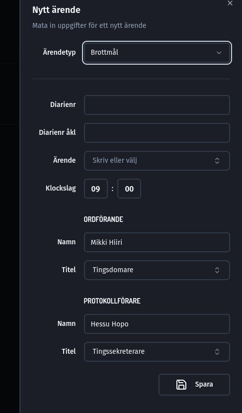
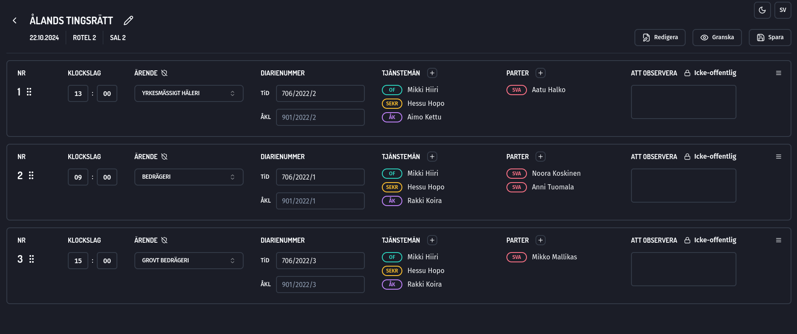
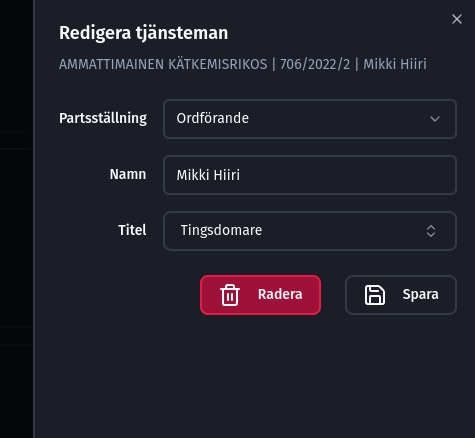

<style>
    @import url("https://fonts.googleapis.com/css2?family=Dosis:wght@200..800&family=Fira+Sans:ital,wght@0,100;0,200;0,300;0,400;0,500;0,600;0,700;0,800;0,900;1,100;1,200;1,300;1,400;1,500;1,600;1,700;1,800;1,900&family=Kablammo&family=Teko:wght@300..700&display=swap");

    body {
        background-color: #0f1014;
        color: #e3e4e8;
        font-family: "Fira Sans";
    }

    h1, h2, h3, h4, h5, h6 {
        font-family: Dosis;
        text-transform: uppercase;
        font-weight: bold !important;
        margin-top: 30px !important;
    }

    img {
        display: block;
        margin-left: auto;
        margin-right: auto;
        margin-top: 30px;
        margin-bottom: 30px;
        border-radius: 20px;
        background-color: transparent;
        border: 2px solid #59607d !important;
    }

    a {
      color: #06b6d4 !important;
    }

    a:hover {
      color: #14b8a6 !important;
      text-decoration: none !important;
    }

    pre {
      background-color: #282c39 !important;
    }

    p > code {
      background-color: #282c39 !important;
    }

    .markdown-body img {
      background-color: transparent;
    }

    .highlight {
      background-color: transparent;
    }
</style>

<div style="width: 100%; display: flex; justify-content: end;">
  <a style="margin-left: 100px;" href="https://thegreenbureau.github.io/curia/">FI</a>
</div>


## Inledning <!-- omit in toc -->

Välkommen att läsa Curias bruksanvisning! Curia är en applikation med öppen källkod som utvecklats internt inom förvaltningsområdet för att utarbeta uppropslistor. Syftet med applikationen är att underlätta utarbetandet av uppropslistor på basis av de CSV-filer och Sakari-uppgifter som AIPA producerar samt att möjliggöra en mer systematisk hantering av listorna. Applikationen förenhetligar dessutom uppropslistorna i fråga om utseende och layout.

Källkoden för Curia finns [här](https://github.com/TheGreenBureau/curia).

Det är ganska lätt att använda applikationen! I följande avsnitt beskrivs huvuddragen i funktionerna.

## Innehåll <!-- omit in toc -->

- [1. Installation](#1-installation)
- [2. Huvudvy](#2-huvudvy)
  - [2.1. Inställningar](#21-inställningar)
    - [2.1.1. Uppropslistelagring](#211-uppropslistelagring)
    - [2.1.2. Förvalda uppgifter](#212-förvalda-uppgifter)
- [3. Att bläddra i uppropslistor](#3-att-bläddra-i-uppropslistor)
  - [3.1. Filtrering av uppropslistor](#31-filtrering-av-uppropslistor)
  - [3.2. Att välja med datum](#32-att-välja-med-datum)
  - [3.3. Lista över upptäckta uppropslistor](#33-lista-över-upptäckta-uppropslistor)
  - [3.4. Att hämta från filer](#34-att-hämta-från-filer)
- [4. Att skapa nya uppropslistor](#4-att-skapa-nya-uppropslistor)
- [5. Vy för uppropslista utan ärenden](#5-vy-för-uppropslista-utan-ärenden)
  - [5.1. Redigering av domstolsuppgifter](#51-redigering-av-domstolsuppgifter)
  - [5.2. Nytt ärende](#52-nytt-ärende)
  - [5.3. Hämta CSV](#53-hämta-csv)
- [6. Vy för uppropslista i ärendena](#6-vy-för-uppropslista-i-ärendena)
  - [6.1. Åtgärder som kan utföras direkt i vyn](#61-åtgärder-som-kan-utföras-direkt-i-vyn)
    - [6.1.1. Omordnande av ärenden](#611-omordnande-av-ärenden)
    - [6.1.2. Att anteckna ett ärende som hemligt](#612-att-anteckna-ett-ärende-som-hemligt)
    - [6.1.3. Att lägga till observationer och hur de syns](#613-att-lägga-till-observationer-och-hur-de-syns)
  - [6.2. Funktioner som öppnas separat i vyn](#62-funktioner-som-öppnas-separat-i-vyn)
    - [6.2.1. Att lägga till personer och att redigera uppgifterna](#621-att-lägga-till-personer-och-att-redigera-uppgifterna)
    - [6.2.2. Radering av ett ärende](#622-radering-av-ett-ärende)
    - [6.2.3. Kronologisk ordning av ärenden](#623-kronologisk-ordning-av-ärenden)
    - [6.2.4. Att skapa ett nytt ärende och att importera en CSV-fil](#624-att-skapa-ett-nytt-ärende-och-att-importera-en-csv-fil)
    - [6.2.5. Förhandsgranskning](#625-förhandsgranskning)
    - [6.2.6. Sparande av uppropslistor i PDF-format](#626-sparande-av-uppropslistor-i-pdf-format)
- [7. Hur ändringar sparas](#7-hur-ändringar-sparas)
- [8. Om språkval och översättningar](#8-om-språkval-och-översättningar)

## 1. Installation

Applikationen Curia finns i Software Center och du kan installera den därifrån. Den går lättast att hitta genom att skriva ”curia” i sökrutan i Software Center och trycka på Retur. Den egentliga installationen sker på samma sätt som med andra applikationer som installeras via Software Center.

Efter installationen startar Curia. Genvägar/ikoner för Curia skapas på skrivbordet och startmenyn.

## 2. Huvudvy

Curia öppnas först i följande huvudvy:


I huvudvyn kan följande åtgärder vidtas:

1. Börja skapa en ny uppropslista
2. Bläddra och ta bort tidigare uppropslistor
3. Öppna någon en av de senaste fem uppropslistorna
4. Ändra inställningar (kugghjulsknappen)

Dessutom är det möjligt att vidta följande åtgärder som också syns i andra vyer:

1. Ändra tema för appen (mörkt, ljust eller system)
2. Ändra applikationens språk (finska eller svenska)

### 2.1. Inställningar

Inställningarna i appen ser ut på följande sätt:


#### 2.1.1. Uppropslistelagring

Här kan du välja var de uppropslistor du utarbetat ska sparas och var man ska söka de sparade uppropslistorn. Bilden visar standardmappens placering i Linux-operativsystemet. I Windows är standardplatsen i stort sett någon av följande:

```
C:\Käyttäjät\[KIEKU-TUNNUS]\AppData\curia\listings
```

Platsen kan ändras till exempel till en gemensamt överenskommen nätverksdisk där uppropslistefiler sparas. Då har alla användare på samma verksamhetsställe åtkomst till samma listor.

Uppropslistorna är sparade i JSON-format innan de exporteras till PDF-format. Detta format är framför allt avsett för maskinläsning. Dessutom sparas uppropslistorna med unika, automatiskt genererade namn (t.ex. `11ffd37c-c743-43f1-83ae-4b2da56e17ab.jtl`). Det är inte meningen att uppropslistemappen ska bläddras till exempel i Utforskaren, utan den ska granskas direkt i applikationen.

#### 2.1.2. Förvalda uppgifter

Här kan du mata in förvalda uppgifter för nya uppropslistor och mål.

Den CSV-fil som produceras av AIPA innehåller inga uppgifter om domstol eller sammansättning, utan uppgifterna ska matas in separat av användaren. Här är det dock möjligt att göra förval så att samma uppgifter inte behöver skrivas varje gång en uppropslista skapas. Standardinformationen dvs. de förvalda uppgifterna kan ändras från fall till fall.

Valen som gäller domstolarna baserar sig på en enkät som gjordes till domstolarna under 2024. I enkäten frågades bland annat om varje domstols svenskspråkiga namn, avdelningar, salar och sammanträdesplatser.

Titlarna dvs. tjänstebeteckningarna innehåller färdiga val som kan användas. Dessa val översätts automatiskt till svenska eller finska beroende på vilket språk uppropslistan ska exporteras till PDF-format. Det är också möjligt att mata in fri text i titlarna. I sådana fall kan översättningen dock inte göras automatiskt.

## 3. Att bläddra i uppropslistor

Vyn för bläddring i uppropslistor ser ut på följande sätt:


I vyn för blddring i uppropslistorna hittar du följande funktioner:

### 3.1. Filtrering av uppropslistor

Det är en fritextsökning som hämtar den angivna strängen från alla fält i tabellen. Till exempel ”15.10.” hittar alla uppropslistor med datumet eller tidpunkten då de skapats är 15.10.

### 3.2. Att välja med datum

Med den här funktionen kan du välja alla uppropslistor i mappen med _datum_ (dvs. inte tidpunkt för skapande) före eller efter det valda datumet. Med funktionen är det alltså möjligt att till exempel på en gång radera alla uppropslistor som är äldre än en viss ålder.

Använd detta försiktigt för att undvika oavsiktlig radering av listor som inte det inte är meningen att du ska radera. Raderingen är permanent - raderade listor kan inte återställas!

Raderingen ska dock bekräftas innan den genomförs. Dessutom måste radering väljas separat. När du väljer bara med datum gör det inget annat än väljer det datumet. Rubriken ”Välj datum” ändrar färg när ärenden har valts just med hjälp av denna funktion.

### 3.3. Lista över upptäckta uppropslistor

Här listas alla uppropslistor inklusive uppgifter som finns i den uppropslistemapp som valts i inställningarna. I vyn visas 10 uppropslistor åt gången. Du kan navigera till följande och föregående sida med knapparna ”Föregående” och ”Nästa”. I praktiken är det lättast att hitta en lista genom att hämta den.

Man kan klicka på rubrikerna i listvyn. Genom att klicka på en rubrik ordnas listan utifrån uppgifterna i fråga antingen i stigande eller fallande ordning.

Du kan öppna en enskild uppropslista genom att klicka på bilden av mappen till sist på raden.

Du kan välja enskilda uppropslistor genom att kryssa för rutan till vänster. Du kan välja alla uppropslistor via rutan i rubrikraden. När en eller flera uppropslistor har valts visas knappen ”Radera”. Genom att klicka på den kan du radera de valda uppropslistorna.

Som nämnts ovan är raderingen av uppropslistor en permanent åtgärd! Var därför försiktig med vilka listor du raderar. Raderingen ska bekräftas innan den genomförs.

### 3.4. Att hämta från filer

Om du har en uppropslistefil (.jtl) någon annanstans än i den uppropslistemapp som valts i inställningarna, kan du importera den till Curia genom att klicka på knappen ”Hämta från filer”. Uppropslistefiler kan skickas till exempel per e-post, om det finns behov för detta.

## 4. Att skapa nya uppropslistor

Vyn för skapande av en ny uppropslista ser ut på följande sätt:


Uppgifterna om domstolen matas in i valen. De standarduppgifter som anges i inställningarna ges som valmöjligheter, men de kan ändras här (och även senare).

Dessutom anges datum för uppropslistan. Dagen i fråga anges som standard för datumet.

## 5. Vy för uppropslista utan ärenden

En ny uppropslista öppnas i följande vy:



### 5.1. Redigering av domstolsuppgifter

Uppgifterna om domstolen kan redigeras genom att klicka på pennbilden bredvid domstolens namn. Menyn som öppnas ser ut så här:



I menyn kan du ändra uppgifterna, som tidigare när du skapade en uppropslista. Dessutom kan du lägga till information om tidpunkten för pausen.

Observationer om hela uppropslistan (som alltså kan läggas till här) kan visas på tre olika sätt.

1. Icke-offentliga observationer syns bara inom Curia. De kan alltså användas som egna anteckningar som _inte visas_ i PDF-versionerna av uppropslistan (den offentliga eller åklagarexemplaret).

2. De offentliga observationerna syns både i den offentliga uppropslistan och i åklagarexemplaret av den. Det kan vara fråga om vilken allmän anteckning som helst som man av någon anledning vill ha i uppropslistan (t.ex. ”Obs! Salen har ändrats.”).

3. Observationer som gäller åklagaren visas endast i åklagarexemplaret av uppropslistan, men _inte_ i den offentliga versionen.

Ändringarna behålls när du klickar på knappen ”Spara”. Om du klickar utanför det öppnade fönstret eller på slutaren i det övre högra hörnet stängs fönstret och ändringarna sparas inte.

### 5.2. Nytt ärende

Genom att klicka på den här knappen kan du skapa ett nytt ärende manuellt (t.ex. utifrån uppgifter från Sakari). Fönstret för uppgifter om ett nytt ärende ser ut så här när det öppnas:



I fönstret som öppnas kan du mata in uppgifterna om ärendet.

I uppropslistan listas alla brottsrubriker i enlighet med Statistikcentralens kod för brottsrubriceringar och enligt språkvalet på finska eller svenska. Rubriceringar kan sökas och de översätts automatiskt beroende på om språkvalet är finska eller svenska. Det är också möjligt att mata in fri text i fältet, men den kan inte översättas automatiskt.

Ordförandens och protokollförarens uppgifter (för ärendet i fråga) hämtas från de standarduppgifter (förval) som angetts i inställningarna, men de kan bytas ut här (och även senare).

När uppgifterna är klara klickar du på knappen ”Spara”, så läggs ärendet till i uppropslistan. Om du klickar utanför fönstret eller på slutaren i det övre hörnet stängs fönstret utan att uppgifterna sparas och utan att ärendet läggs till i listan.

### 5.3. Hämta CSV

Genom att klicka på den här knappen kan du söka en sådan uppropslista i .csv-format på din dator som du har hämtat från AIPA till din dator. Uppgifterna i den aktuella CSV-filen förs in i uppropslistan som separata ärenden och med följande standarduppgifter som matats in i inställningarna (som inte finns i CSV-filen):

1. Ordföranden
2. Protokollförare
3. Åklagarens (eller åklagarnas) titel

Följande uppgifter hämtas från CSV-filen till ärendena:

1. Klockslag
2. Ärende
3. Ärendenummer
4. Åklagare
5. Svarande

Brottsrubriceringarna i AIPA motsvarar Statistikcentralens kod för brottsrubriceringar, så de kan översättas direkt till svenska eller finska i uppropslistan.

De ärenden som hämtats ordnas i uppropslistan i den ordning de har förts in i CSV-filen.

Man kan inkludera så många CSV-filer man vill i uppropslistan. Om det i ärenden som finns i den CSV-fil som ska hämtas finns sådana ärenden där domstolens ärendenummer redan finns i uppropslistan, uppdateras det befintliga ärendet i stället för att det läggs till.

Detta gör det möjligt att de uppgifter i en CSV-fil som redan har hämtats en gång uppdateras i uppropslistan utifrån de uppgifter som har redigerats i AIPA. Det sker genom att man sparar en ny CSV-fil från AIPA och hämtar den till Curia. Om man gör så stryks de ärenden som inte längre är aktuella i AIPA också ur Curias uppropslista, nya ärenden läggs till och befintliga uppdateras (t.ex. klockslag och svarande). Manuellt skapade ärenden påverkas inte av detta. Sakariärendena på listan förblir alltså oförändrade, även om en ny CSV-fil skulle hämtas till listan.

## 6. Vy för uppropslista i ärendena

När ärenden har skapats i eller hämtats till en uppropslista ser den ut så här:



I den här vyn är det möjligt att direkt:

1. Ordna om ärenden
2. Redigera klockslag, ärende och ärendenummer
3. Lägga till observationer till ärendet
4. Anteckna ett ärende som hemligt

### 6.1. Åtgärder som kan utföras direkt i vyn

#### 6.1.1. Omordnande av ärenden

Det går att ordna om ärenden genom att ta tag i de sex punkter bredvid ärendets ordningsnummer och släpa upp eller ner ärendet i listan. Numret uppdateras enligt ordningsföljd.

#### 6.1.2. Att anteckna ett ärende som hemligt

Ärendet kan antecknas som hemligt genom att man klickar på sköldikonen bredvid rubriken ”Ärende”. I hemliga ärenden syns texten ”Hemligt” och en röd kant. I sådana ärenden ska anteckningen ”Hemligt” sättas upp på uppropslistan.

#### 6.1.3. Att lägga till observationer och hur de syns

För det hur observationerna syns gäller detsamma som i punkten ”7.1. Redigering av domstolens uppgifter”. Dessa observationer visas, i den mån man har har valt att de ska synas som ”Offentlig” eller ”Åklagare”, i en uppropslista i samband med ärendet i fråga. Med hjälp av dessa kan man alltså anteckna vissa observationer som gäller just ärendet i fråga och inte sammanträdesdagen i allmänhet.

### 6.2. Funktioner som öppnas separat i vyn

I de fönster som öppnas separat i vyn kan du:

1. Lägga till tjänstemän och parter
2. Redigera befintliga tjänstemäns och parters uppgifter
3. Radera ett ärende
4. Ordna ärenden i kronologisk ordning
5. Skapa ett nytt ärende
6. Importera CSV-fil
7. Förhandsgranska den offentliga versionen eller åklagarexemplaret
8. Spara en offentlig version eller ett åklagarexemplar

#### 6.2.1. Att lägga till personer och att redigera uppgifterna

Personerna i ett ärende har indelats i tjänstemän (personer som arbetar inom justitieförvaltningen) och parter (alla andra). ”Parter” har valts som rubrik, trots att gruppen bland annat också innehåller vittnen. Bredvid personernas namn visas personens ställning i ärendet med förkortning och färgkod.

I den offentliga uppropslistan visas endast domstolens sammansättning, åklagarna och svarandena. I åklagarexemplaret visas också andra personer som eventuellt lagts till i ärendet, såsom målsägande, samt eventuella stämningsuppgifter och andra uppgifter som lagts till dem.

Man kan lägga till en ny person genom att du klickar på +-knappen bredvid rubriken. På motsvarande sätt kan du ändra uppgifterna om en befintlig person genom att klicka på personens namn. I båda fallen ser fönstret likadant ut.

Fönstret för redigering av uppgifter om en tjänsteman ser ut så här:



På basis av tjänstemannens ställning väljs eventuella titlar. Som sagt kan fri text matas in i titeln, men den översätts inte automatiskt till det andran språket.

På motsvarande sätt ser fönstret för redigering av "parter" ut så här:


Precis som för en tjänsteman beror de fält som visas och de val som görs i dem på den ställning som getts en "part".

Ändringar som du gjort för en ny person eller för en person kan du spara genom att klicka på knappen ”Spara”. Om du klickar utanför fönstret eller på slutaren överst, sparas inga ändringar eller ingen ny person. Du kan radera en person helt och hållet från ett ärende genom att klicka på "Radera”-knappen.

#### 6.2.2. Radering av ett ärende

Det går att radera ett ärende genom att du klickar på hamburgermenyn till höger om anteckningen av ett enskilt ärende och sedan klickar på ”Radera”.


#### 6.2.3. Kronologisk ordning av ärenden

Ett ärende kan ordnas automatiskt i kronologisk ordning enligt begynnelsetidpunkten i uppropslistan. Valet görs genom att klicka på ”Redigera” och sedan på ”Kronologisk ordning” enligt följande:


Om ärendena redan finns på listan i kronologisk ordning, är den nämnda knappen grå och man kan inte klicka på den.

Om man har satt ut samma begynnelseklockslag för flera ärenden, ordnas dessa ärenden i ärendet i den ordning de redan står i sitt inbördes förhållande. Praktiskt taget nästan godtyckligt. Ordningsföljden för dessa kan sedan ändras genom att släpa dem manuellt, om det behövs.

#### 6.2.4. Att skapa ett nytt ärende och att importera en CSV-fil

Här gäller vad som sägs i punkterna ”7.2. Nytt ärende” och ”7.3. Hämta CSV”. Knapparna finns bakom knappen ”Redigera”:


#### 6.2.5. Förhandsgranskning

Både det offentliga exemplaret och åklagarexemplarets PDF-utskrift kan förhandsgranskas via knappen ”Granska”:


Dokumentet som du vill förhandsgranska öppnas i ett separat popup-fönster. Förhandsgranskningen i fråga motsvarar helt det dokument som också sparas vid valet. Om det görs ändringar i uppropslistan uppdateras förhandsgranskningen.

#### 6.2.6. Sparande av uppropslistor i PDF-format

De slutliga uppropslistorna sparas i PDF-format genom att du klickar på knappen ”Spara” och sedan välja om man vill spara ett offentligt exemplar eller åklagarens exemplar:


Efter valet frågar appen separat om var du vill att uppropslistan ska sparas. Filen som sparas får ett standardnamn som innehåller:

1. Uppgift om datum (i formen år-månad-dag för att filen ska vara korrekt ordnad i utforskaren)
2. Domstolens förkortning
3. Information om salen
4. Uppgift om huruvida det är fråga om ett offentligt exemplar eller åklagarens version

Om du vill, kan du ändra namnet på den fil som du vill spara.

## 7. Hur ändringar sparas

Ändringar i uppropslistan sparas huvudsakligen automatiskt. Om du således ändrar till exempel ärendenumren i ett mål, behöver ändringen inte på något sätt sparas separat.

Till den del vissa ändringar ska godkännas separat visas knappen ”Spara” synligt i applikationen eller så anges detta på annat sätt synligt.

## 8. Om språkval och översättningar

Alla översättningar i både appen och uppropslistan görs när man väljer det andra språket. På så sätt är det möjligt att översätta uppropslistorna direkt t.ex. från finska till svenska genom att välja svenska som applikationsspråk.

Då översätts bland annat uppropslistans rubriker, domstolens uppgifter (till den del de har meddelats på svenska) samt andra ärenden och titlar än de som angetts i fri text. Dessutom översätts andra texter som ska ingå som färdigt innehåll i uppropslistan.

Curia producerar alltså inte så kallade tvåspråkiga uppropslistor, men via en knapp kan hela uppropslistan översättas till det andra språket. Två versioner av uppropslistan kan sedan sparas, den ena på finska och den andra på svenska. Dessa kan också skrivas ut för att läggas fram bredvid varandra.
